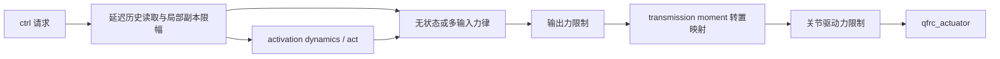

# E2 · 从控制输入到实际驱动力

基线为 **MuJoCo 3.15.0 原生核心与官方 Python 绑定**，固定提交 `9ea3cdfcae93bf2cc4dc0e1a1627c5a39a1e06e5`。先修：[状态与时间](state-and-time.md)、基本反馈控制和功率/力矩单位。本篇完成 A3：能够从 ctrl 追到内部 activation、输出力、传动与广义力，并解释饱和、PD 和控制更新时机。机器人与任务分别见[运动学](robotics-and-kinematics.md)、[任务接口](task-interfaces.md)。

这是源码课程，原生片段未编译或运行，不包含控制性能验证。此处的行为不能自动推广到 MJX、MuJoCo-Warp 或外部机器人驱动器；模型、核心、绑定、宿主控制器要各自记录版本。

## 1. 三种写入，三种物理语义

| 写入 | 做了什么 | 没有做什么 |
|---|---|---|
| `data.qpos/qvel` | 指定配置/速度，可用于初始化、恢复或运动学求解 | 没有施力使机器人沿连续轨迹到达该状态 |
| `data.ctrl` | 给原生 actuator 的控制输入 | 不普遍等于关节力矩、位置或电压 |
| `data.qfrc_applied/xfrc_applied` | 直接加入广义力/Cartesian 外力 | 不经过 actuator 的输入/输出限幅，不代表真实电机可实现 |

把每步覆盖 qpos 当位置控制，会绕过执行器响应、力限额及真实到达过程。把期望末端力直接写进 ctrl，也只有在明确的 transmission/gain 下才有对应含义。`ctrl` 的物理单位属于 actuator 的输入契约，而不是数组自己的性质。

## 2. 3.15 的执行器是输入块、状态块和输出块

本版本不再能用一个 actuator ID 索引所有数组。PID 可以同时接收位置、速度和前馈；orientation 可以接收四元数并输出三维力矩。

| 计数/地址 | 尺寸 | 解释 |
|---|---|---|
| `nactuator` | 一个整数 | actuator 对象数 |
| `nu`、`actuator_ctrladr/ctrlnum` | ctrl 标量总数、每对象一项地址/长度 | 输入块；`ctrlrange/ctrllimited` **按 nu** 存储 |
| `na`、`actuator_actadr/actnum` | activation 总数、每对象一项地址/长度 | 内部状态块；无状态时 actadr=-1 |
| `nout`、`actuator_outadr/outnum` | 力输出标量总数、每对象一项地址/长度 | `actuator_force/length/velocity` 按输出解释 |
| `actuator_gear` | nout × 6 | 每个输出对应的传动比例/方向 |
| `actuator_moment` 与 `moment_*` | 稀疏 nout × nv 的存储 | 输出力到广义力的映射，不可直接 reshape 为稠密矩阵 |

先 `aid=model.actuator(name).id`，再读取输入与输出地址。输入名称可用 `mj_actuatorInputName` 核对，但并非所有 actuator 都提供名称。`actuator_force[aid]` 对多输入多输出混合模型一般错误。[模型字段](https://github.com/google-deepmind/mujoco/blob/9ea3cdfcae93bf2cc4dc0e1a1627c5a39a1e06e5/include/mujoco/mjmodel.h#L781)、[稀疏 moment 字段](https://github.com/google-deepmind/mujoco/blob/9ea3cdfcae93bf2cc4dc0e1a1627c5a39a1e06e5/include/mujoco/mjdata.h#L263)、[输入名称 API](https://github.com/google-deepmind/mujoco/blob/9ea3cdfcae93bf2cc4dc0e1a1627c5a39a1e06e5/include/mujoco/mujoco.h#L609)。

[原创双关节模型](../examples/control-robotics/two_link.xml)只有两个 actuator，却有三个 ctrl：shoulder PID 是 `[pos, vel]`，elbow motor 是一个标量。`nactuator=2, nu=3, nout=2` 是源码推导，未运行验证。

## 3. 力生成链路：不要遗漏中间阶段

这是常见执行路径示意；tendon 合力限制、SO3 范数限制、DC motor 机械项和 gravity compensation 在下文单列。真实顺序读取 `mj_fwdActuation`，不能由 XML 中元素排布猜测。[力生成实现](https://github.com/google-deepmind/mujoco/blob/9ea3cdfcae93bf2cc4dc0e1a1627c5a39a1e06e5/src/engine/engine_forward.c#L364)。

1. 复制 ctrl 到局部缓冲；有 delay 时从带时间戳的 history 读取；按每个输入的范围限幅。
2. 用该局部输入计算 activation 导数。无状态 actuator 直接读控制；有状态 actuator 读 act，`actearly` 可使用本步预计更新值。
3. 按 gain/bias 或特定多输入力律得到输出，调用适用的 actuator plugin。
4. 应用 tendon 合力与 actuator 输出限制，做本类型额外处理。
5. 将输出通过 moment 转置累加成广义力，加入选择在 actuator 侧处理的重力补偿，再做标量 joint 的合力限制。

**输入限幅只修改局部副本。** 请求 `ctrl=10` 而范围为 `[-1,1]` 时，data.ctrl 仍可能读到 10；不能用它作为限幅后实际输入的日志。启用 delay 时即使自己对当前请求做 clip，也未必等于这一时刻从 history 读到的有效输入。[局部副本与 delay](https://github.com/google-deepmind/mujoco/blob/9ea3cdfcae93bf2cc4dc0e1a1627c5a39a1e06e5/src/engine/engine_forward.c#L387)。

## 4. transmission：gear 同时改变速度、长度和力

对有标量长度的普通传动，令 $l(q)$ 为 actuator length，$B=\partial l/\partial q$ 表示对配置切空间的映射，则 $\dot l=Bv$，虚功给出 $\tau_a=B^Tp$。多输出时 B 有 nout 行，p 为 nout 维输出。对于 free/site 推力器等没有有意义标量长度的路径，源码仍构造力映射，却将 length 设为零；不要由“length 恒零”错误推出它不能施力。[mj_transmission](https://github.com/google-deepmind/mujoco/blob/9ea3cdfcae93bf2cc4dc0e1a1627c5a39a1e06e5/src/engine/engine_core_smooth.c#L1273)。

对单一 hinge、gear=$g$：$l=gq$、$\dot l=g\dot q$、$\tau=gp$。motor 的单位 gain 下 p=u，因此 gear=2、u=0.8 的关节力矩为 1.6 N·m，尚需继续检查 joint 限制。position actuator 的 setpoint 是 l 的目标，q 目标为 $q_d$ 时应给 $u=gq_d$。如果 $p=k_p(u-gq)-k_vg\dot q$，映射到关节后刚度与阻尼均含 $g^2$，改变 gear 不能只调整 torque 上限。[joint transmission 实现](https://github.com/google-deepmind/mujoco/blob/9ea3cdfcae93bf2cc4dc0e1a1627c5a39a1e06e5/src/engine/engine_core_smooth.c#L1327)。

| 目标类型 | 原生语义 | 建模注意 |
|---|---|---|
| hinge / slide joint | gear[0] 缩放 q、速度和力映射 | gain 只影响力生成，不能代替 gear |
| ball joint | gear 选局部转轴；标量 length 来自旋转向量投影 | 三个独立标量 servo 不等于完整 SO3 误差控制 |
| free joint | 平移 gear 为世界轴、旋转 gear 为 child 轴，length=0 | 不能靠普通 position servo 的长度误差设定自由体 pose |
| jointinparent | ball/free 的旋转 gear 改按父轴解释 | 对 free 而言父轴就是世界轴 |
| tendon | 沿 tendon length 与 moment 映射到多个 DOF | 一个力输出可以驱动多个关节，欠驱动性仍存在 |
| site，无 refsite | site 坐标中的力/力矩方向，length=0 | 更接近推力器接口 |
| site + refsite | 相对 refsite 的位姿差投影与对应力映射 | 控制参考坐标是 refsite；移动参考物也改变问题 |
| body | adhesion 的接触法向力分配 | 接触依赖，不是通用 body pose 控制 |

位置与角度混入同一 gear 投影时量纲容易混乱；本课程只采用纯平移或纯旋转方向。`armature` 与 actuator `damping` 会按 gear² 反射到 joint/tendon，不等于增益矩阵。多个 actuator 指向同一关节时这类参数可累加。[gear 与 armature](https://github.com/google-deepmind/mujoco/blob/9ea3cdfcae93bf2cc4dc0e1a1627c5a39a1e06e5/doc/XMLreference.rst#L5600)。

标量 joint transmission 使用的是 qpos 本身乘 gear；FK 则使用 qpos−qpos0 表达相对参考运动。这意味着非零 ref 的模型在初始 pose 也可能有非零 actuator length，servo 的初始 setpoint 不能一律设成零。

## 5. 从常用 shortcut 到力律

以下公式首先限于单一标量传动、无额外默认类污染、无 delay、无 saturation；q/l 的单位按传动确定。XML shortcut 会写 general 的参数，并非创建另一套运行时对象。默认类中混用 position/motor/general 可能遗留 bias 参数，需读回 `gaintype/biastype/dyntype/gainprm/biasprm`。[XML 到 shortcut API](https://github.com/google-deepmind/mujoco/blob/9ea3cdfcae93bf2cc4dc0e1a1627c5a39a1e06e5/src/xml/xml_native_reader.cc#L1195)、[参数写入实现](https://github.com/google-deepmind/mujoco/blob/9ea3cdfcae93bf2cc4dc0e1a1627c5a39a1e06e5/src/user/user_api.cc#L1221)。

| actuator | 输入含义 | 典型输出与状态 |
|---|---|---|
| `motor` | 传动空间的直接输出请求 | p=u，unit gain、无 bias、无 activation；不含真实电机电气动态 |
| `position` | 目标 length | $p=k_p(u-l)-k_v\dot l$；timeconst>0 时目标先经 filterexact |
| `velocity` | 目标 length 速度 | $p=k_v(u-\dot l)$；保持零输入仍施加阻尼 |
| `intvelocity` | 目标 length 的变化率 | $\dot w=u$、$p=k_p(w-l)-k_v\dot l$；w 是位置目标，不是物体真实位置 |
| `pid` | 选定的 pos、vel、ff 输入块 | $p=k_p(u_p-l)+k_v(u_v-\dot l)+u_f+k_i z$；按启用项分配 slew/integral 状态 |
| `orientation` | expmap 或四元数目标 | SO3 测地误差 PD，3 个输出，见下节 |

普通 SISO general 的输出可写为 $p=a(l,\dot l)z+b_0+b_1l+b_2\dot l$，其中无 activation 时 z=u，有 activation 时 z 由对应状态路径提供。fixed gain 使用常数，affine gain 可依赖 length/velocity，muscle 使用其长度/速度规律，user 路径可由原生 gain/bias/dynamics 回调提供；插件走插件计算入口。这个公式不是 PID/SO3/DC motor 的万能定义，要先识别类型再读分支。[gain 与 bias 分派](https://github.com/google-deepmind/mujoco/blob/9ea3cdfcae93bf2cc4dc0e1a1627c5a39a1e06e5/src/engine/engine_forward.c#L696)。

position 默认 kp=1、kv=0、timeconst=0；velocity 默认 kv=1；pid 默认输入 `pos vel`、kp=1、kv=ki=0。这些是 3.15 的未覆盖默认设置，不代表导入机器人或历史实验值。[position 参数](https://github.com/google-deepmind/mujoco/blob/9ea3cdfcae93bf2cc4dc0e1a1627c5a39a1e06e5/doc/XMLreference.rst#L6017)、[pid 参数](https://github.com/google-deepmind/mujoco/blob/9ea3cdfcae93bf2cc4dc0e1a1627c5a39a1e06e5/doc/XMLreference.rst#L6066)。

对 gear=1 的转动 servo，kp 单位为 N·m/rad，kv 为 N·m·s/rad；积分状态 z 的单位为 rad·s，ki 为 N·m/(rad·s)。slide 对应 N/m 等平移量纲。`dampratio` 用参考配置的反射质量/惯量计算阻尼，且不计同处已有被动 damping/frictionloss，不能保证整个耦合机器人所有姿态都临界阻尼。`kv` 与 dampratio 互斥。[阻尼比假设](https://github.com/google-deepmind/mujoco/blob/9ea3cdfcae93bf2cc4dc0e1a1627c5a39a1e06e5/doc/XMLreference.rst#L6028)。

PID 输入按存在项以 pos、vel、ff 的标准顺序压紧，不是三个固定槽；缺失 setpoint 取零，缺失 ff 没有该输入。编译后 pos 使用 ctrlrange/posrange，vel/ff 用各自范围；二者只有下界小于上界才启用相应限制。使用 ctrladr 加偏移前先核对 ctrlspec/ctrlnum。[编译输入块](https://github.com/google-deepmind/mujoco/blob/9ea3cdfcae93bf2cc4dc0e1a1627c5a39a1e06e5/src/user/user_objects.cc#L7161)、[逐输入范围](https://github.com/google-deepmind/mujoco/blob/9ea3cdfcae93bf2cc4dc0e1a1627c5a39a1e06e5/src/user/user_objects.cc#L7436)。

`imax=0` 表示不限制积分积累，`slewmax=0` 表示不限制目标变化率。原生 imax 的状态限幅不是任意外部限幅下的完整 anti-windup 设计：若外层再限制力矩/速度，仍要考虑目标不可达与积分饱和。外部 PID 的积分器则属于应用状态，reset/快照必须一并管理。

### activation 与延迟

`filter` 与 `filterexact` 描述相同一阶方程 $\dot w=(u-w)/\tau$，但后者对固定输入使用 $w^+=w+(u-w)(1-e^{-h/\tau})$。不能从这一个滤波器的稳定性推断整个有接触机器人稳定。intvelocity 要限制 act 的位置目标，限制 ctrl 只限制目标变化率，不能阻止长时间积分把目标推过关节界限。[activation 实现](https://github.com/google-deepmind/mujoco/blob/9ea3cdfcae93bf2cc4dc0e1a1627c5a39a1e06e5/src/engine/engine_forward.c#L411)。

`delay`/`nsample` 在控制链前使用 history；它们与上述动态状态是不同延迟来源。stateful actuator 的 `actearly` 改变力使用旧 act 还是预计新 act，但并未移除其内部状态。本版本同时存在多状态 PID/DC motor 和多维 SO3，不能沿用旧概述“每个有状态 actuator 恰好一个 act”的计数公式。

## 6. 原生 SO3 与 DC motor 的边界

orientation 用 $e=\log(Q^{-1}Q_d)$，在传动的 child frame 表达，输出 $p=k_pe-k_v\omega$（常规零 bias）。expmap 是 3 个输入，quat 是 wxyz 的 4 个输入，两者均输出 3 个力矩分量。quat 会归一化，符号相反的 Q 表示相同目标；输出 forcerange 限制向量范数并保留方向，要求下界为 0。逐分量裁剪 ctrl 四元数不是姿态角限制。[SO3 力生成](https://github.com/google-deepmind/mujoco/blob/9ea3cdfcae93bf2cc4dc0e1a1627c5a39a1e06e5/src/engine/engine_forward.c#L640)。

编译器限定 orientation 的目标为 ball joint 或带 refsite 的 site；quat 输入要求无 activation dynamics，积分型目标只能用 expmap。旋转误差在 π 附近仍有对数映射分支，不能据“测地误差”宣称全局光滑。3.15 对普通 ball/refsite 旋转 servo 还有环形 setpoint 包裹，但 filtered position 的匹配条件不同，不能套用到所有 servo；本例不用这些分支。[兼容检查](https://github.com/google-deepmind/mujoco/blob/9ea3cdfcae93bf2cc4dc0e1a1627c5a39a1e06e5/src/user/user_objects.cc#L7017)、[wrapPeriod 条件](https://github.com/google-deepmind/mujoco/blob/9ea3cdfcae93bf2cc4dc0e1a1627c5a39a1e06e5/src/engine/engine_forward.c#L311)。

`dcmotor` 与理想 motor 不同。在简化的无饱和、恒定 R/K、无温升/摩擦、固定传动条件下，电气方程为 $L\dot i=V-Ri-K\dot l$，电磁力矩为 $p=Ki$；L=0 时可代数求电流。R 的单位 Ω、L 为 H、K 为 N·m/A（兼作反电动势系数）。原生 input 可为 pos/vel/ff/voltage 的子集，纯 voltage 是默认；input=none 是无控制输入的被动装置，短路反电动势仍可制动。温度、电流、LuGre 和内部控制状态按启用项分配，不能假设只存一个电流值。[DC motor 参数契约](https://github.com/google-deepmind/mujoco/blob/9ea3cdfcae93bf2cc4dc0e1a1627c5a39a1e06e5/doc/XMLreference.rst#L6863)。

DC motor 的控制器 Vmax 不限制下游直接 voltage 输入；cogging/LuGre 机械力在电磁力限幅后相加，因此 actuator_force 不一定落在那个电磁 forcerange 内。若目标是整条 joint 的总 actuator 力限制，要核对关节级限制。热/摩擦参数辨识、肌肉生理模型、插件完整生命周期属于 E6 的特色能力专题；这里已区分它们接入哪个输入/状态/力生成层。[限制后的机械力](https://github.com/google-deepmind/mujoco/blob/9ea3cdfcae93bf2cc4dc0e1a1627c5a39a1e06e5/src/engine/engine_forward.c#L914)。

## 7. 四处限幅不能互换

| 限制 | 限制对象 | 不限制什么 |
|---|---|---|
| ctrlrange | 请求输入的有效局部副本 | 不等于真实关节位置/速度范围 |
| actrange / PID imax | 相应内部状态 | 不直接保证接触力或总关节力 |
| actuator forcerange | 传动前的输出；orientation 为范数 | 映射后可能乘 gear；DC motor 后加机械项另计 |
| joint actuatorfrcrange | 映射后多个 actuator 的总广义力 | 不包含另写的 qfrc_applied、接触力等；本版本仅标量 hinge/slide 支持 |

tendon 还有自己的合力限制。关节 `range` 是位置约束，由约束求解器产生响应，不能替代以上任何一个 clamp。`actuatorgravcomp=true` 会把重力补偿并入 actuator 侧，从而受到 joint 力限制；否则其被动路径不同。[关节限制](https://github.com/google-deepmind/mujoco/blob/9ea3cdfcae93bf2cc4dc0e1a1627c5a39a1e06e5/doc/XMLreference.rst#L2413)、[最终映射/合力限制](https://github.com/google-deepmind/mujoco/blob/9ea3cdfcae93bf2cc4dc0e1a1627c5a39a1e06e5/src/engine/engine_forward.c#L975)。

本例 elbow：请求 10 → ctrl 局部值 1 → motor 输出 1 → forcerange 限为 0.8 → gear=2 后为 1.6 → joint actuatorfrcrange 限为 1.2 N·m。`data.ctrl` 仍保存请求 10，`actuator_force` 表示传动前的 0.8，`qfrc_actuator` 的 elbow 分量表示最终 1.2；这是基于无其他控制/重力补偿条件的源码预测，不是实测。`qfrc_actuator` 也不是对象接触力。

## 8. 两种 PD 接法与回调生命周期

**原生 servo：** XML 声明 position/pid，应用写 setpoint。优点是参数与相关数值处理对引擎可见。用 position 的 kv 时，目标速度隐含为零；需要非零目标速度可用 pid 的 vel 输入。不要把一个外部算出的 torque 再写进 position 的 ctrl。

**外部 PD + motor：** 在关节空间算 $\tau_d=K_p(q_d-q)+K_d(v_d-v)+\tau_{ff}$，再依据传动求可实现输入。只对本例独立、非零 gear、unit-gain motor 有 $u=\tau_d/g$；耦合 tendon、欠驱动、多状态电机需要求分配问题。q_d-q 仅对标量关节是普通相减，球/自由姿态用切空间误差。传动前后限制都会改变期望闭环，不能把控制公式当执行结果。

若用逆动力学前馈，`mj_inverse` 接收 qpos/qvel/qacc，输出 `qfrc_inverse` 是实现给定加速度所需的总外加广义力；它不是“填 ctrl 的向量”。实现会减掉 passive 和 constraint 贡献，还要扣除已由其他输入施加的广义力，并求 actuator 分配。离散模式的 inverse 语义也改变，见 E1/E3。[逆动力学实际合成](https://github.com/google-deepmind/mujoco/blob/9ea3cdfcae93bf2cc4dc0e1a1627c5a39a1e06e5/src/engine/engine_inverse.c#L278)。

`mjcb_control` 在前向位置/速度阶段后、actuation 前调用，可以读取更新过的运动学量。它是**进程级全局函数指针**，不是每份 MjData 的私有控制器；多环境要依据传入 model/data 识别对象并隔离应用状态。Python 用 `set_mjcb_control` 安装，在 finally 中恢复原回调；若现有回调不是经 Python 绑定安装，不应使用 Python getter 去猜指针。[全局回调定义](https://github.com/google-deepmind/mujoco/blob/9ea3cdfcae93bf2cc4dc0e1a1627c5a39a1e06e5/src/engine/engine_callback.c#L20)、[绑定 setter/getter](https://github.com/google-deepmind/mujoco/blob/9ea3cdfcae93bf2cc4dc0e1a1627c5a39a1e06e5/doc/python.rst#L462)。

RK4 可多次调用反馈，额外 `mj_forward` 也可调用。回调内不推进 step、不递归 forward、不阻塞等待网络，不把“调用一次”当作一个控制周期。控制器的积分器/任务状态机应按明确的控制 tick 更新；需要积分器各阶段反馈时，将只读目标/控制状态与无副作用的反馈计算分开。`mj_step1/step2` 适用于已核对的积分分支，RK4 会退化为 Euler；sleep 的唤醒依赖也需保留。[前向回调时点](https://github.com/google-deepmind/mujoco/blob/9ea3cdfcae93bf2cc4dc0e1a1627c5a39a1e06e5/src/engine/engine_forward.c#L1994)。

## 9. 易错诊断与阅读练习

先记录五项：带单位的请求、有效输入来源（当前 ctrl 或 history）、act 状态、actuator 输出、映射后的 qfrc_actuator；再记录采样时点。以下练习不要求跑仿真。

**1.** gear=3 的 position servo，希望关节停在 0.2 rad，ctrl 应是多少？kp=10、kv=1 时等效关节刚度/阻尼是多少？

答案：无包裹等额外分支时 u=0.6；刚度 90 N·m/rad，阻尼 9 N·m·s/rad。若只写 u=0.2，目标变成约 0.0667 rad。

**2.** pid 的 input=`vel ff`，为何不能写 `ctrl[adr+2]=ff`？

答案：存在项被压紧为两项 vel、ff，输入地址为 adr、adr+1；缺失 pos 意味其 setpoint 为零，不是保留空槽。

**3.** actuator_force 没超限，但 joint 总驱动力超出单个执行器的 forcerange，是否一定是 bug？

答案：不一定。要经过 gear/moment 并合并多个 actuator；还需区分 DC motor 后加项与重力补偿。用 joint actuatorfrcrange 限制适用标量关节的最终 actuator 合力，不能拿它限制外加或接触力。

**4.** intvelocity 的 ctrl 已限制为 ±0.1，为何目标仍越界？

答案：ctrl 限制位置目标的变化率，持续积分仍累积。应对 act 的目标位置设置合适范围，同时处理不可达目标、实际 joint 限位和超时。

**5.** 一个双输入 PID 和一个 quat orientation 有多少 actuator、ctrl 和输出？

答案：2、6、4。PID 为 2/1，orientation 为 4/3；activation 个数还取决于各自启用功能，不能由前三个计数猜出。

**6.** 为什么“回调每调用一次就积分控制误差 h”会出错？

答案：RK4 或额外 forward 可能在同一物理步内多次调用；会重复推进应用状态。必须定义实际控制更新时钟，与阶段反馈计算分开。

[E2 验证记录](validation/e2.md)保存源码覆盖、静态检查与未运行边界。下一篇把这些输入契约连接到[机器人运动学](robotics-and-kinematics.md)。
