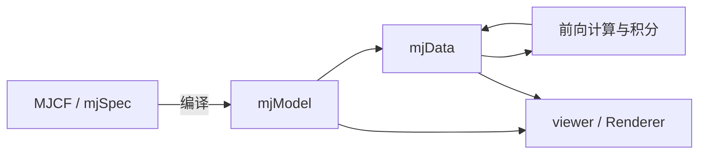

# MuJoCo 从对象到源码

本文基于官方 MuJoCo 3.15.0，源码提交 `9ea3cdfcae93bf2cc4dc0e1a1627c5a39a1e06e5`。当前目标是建立能读代码、解释配置、定位问题的知识结构。文中的最小片段用于理解 API，本轮没有执行物理实验；接触、抓取及性能实验后续引用 DexLab 的对应记录。

## 1. 先理解四层对象



`mjSpec` 是可编辑的模型描述，`mjModel` 是编译后的模型参数与拓扑，`mjData` 是一次仿真的状态、派生量与工作缓冲。一个模型可以对应多份 data；多份 data 不等于它们可以同时写同一组可变模型参数。

场景树不是渲染树的同义词。body 描述运动学组织，geom 描述碰撞和外观，site 用于定位和观测，joint 引入自由度，actuator 把控制量映射为驱动力。不要用增加一个视觉 geom 的方式假定自己添加了一个独立动力学刚体。

源码入口：[模型字段](https://github.com/google-deepmind/mujoco/blob/9ea3cdfcae93bf2cc4dc0e1a1627c5a39a1e06e5/include/mujoco/mjmodel.h)、[运行数据字段](https://github.com/google-deepmind/mujoco/blob/9ea3cdfcae93bf2cc4dc0e1a1627c5a39a1e06e5/include/mujoco/mjdata.h)、[模型编辑](https://github.com/google-deepmind/mujoco/blob/9ea3cdfcae93bf2cc4dc0e1a1627c5a39a1e06e5/doc/programming/modeledit.rst)。

## 2. 建模时区分几何、惯量与坐标

MJCF 的局部坐标沿 body 层级组合。视觉上物体位于某处，不意味着 body 原点或质心也在那里。先检查 body frame、inertial frame、geom frame，再讨论位置、速度和施力点。

质量和惯量可以由几何推断，也可以显式指定；二者均需要核对单位和惯性主轴。网格外观、碰撞几何与惯量近似可能不同，导入同一个网格并不自动保证三个部分具有相同精度。使用 primitive 建模时也要检查 `size` 的定义，例如 box 使用半尺寸。

`default` 提供属性继承，不是运行时控制器；`equality` 是约束，不是普通关节；tendon 描述传动/长度关系，不一定代表真实可变形绳索。flex、肌肉和插件应分别阅读其模型及支持限制，不从“能在 XML 里写出来”推出所有数值配置都兼容。

阅读顺序：[建模说明](https://github.com/google-deepmind/mujoco/blob/9ea3cdfcae93bf2cc4dc0e1a1627c5a39a1e06e5/doc/modeling.rst) → 相关编译字段 → `mjModel` 中的实际数组。

## 3. 状态的维度与意义

`qpos` 长度是 `nq`，`qvel` 长度是 `nv`。位置位于配置空间，速度位于切空间，因此两者不必等长：自由关节的位置包含三维平移和四元数，共 7 个分量；速度为 6 个分量。控制长度 `nu` 又是另一回事，不能把关节数、自由度数、位置长度和驱动器数混用。

索引模型时优先使用命名访问或 ID 查询，再通过 `jnt_qposadr`、`jnt_dofadr` 找到不同状态数组的位置。四元数更新应使用引擎提供的积分/差分函数；逐元素相加一般不会保持单位四元数，也不表示正确的旋转差。

下面的片段未显式调用 `mj_step`；本轮未执行，加载时编译器内部可能执行测试计算：

```python
import mujoco

xml = """
<mujoco>
  <worldbody>
    <body name="box" pos="0 0 1">
      <freejoint/>
      <geom type="box" size="0.05 0.05 0.05" mass="1"/>
    </body>
  </worldbody>
</mujoco>
"""
model = mujoco.MjModel.from_xml_string(xml)
data = mujoco.MjData(model)
mujoco.mj_forward(model, data)
print(model.nq, model.nv, model.nu)
print(data.body("box").xpos)
```

阅读练习：在 XML 中增加一个无 joint 的子 body，解释它为何不会凭空增加独立自由度。再把 freejoint 改为 hinge，分别判断 `nq` 与 `nv` 的变化；先从数据结构解释，暂不要求运行实验。

## 4. 一步仿真做了什么

`mj_forward` 计算给定状态下的派生量和前向动力学，不负责完整的时间推进。`mj_step` 先执行前向计算，然后进入选定的积分分支。直接改写 `qpos` 后，不能假定位置相关派生字段已经同步更新。

3.15.0 的 `mj_step` 包含 Euler、RK4、implicit/implicitfast 和 discrete 分支；discrete 分支还检查 IPC 开关。读旧教程时不能只看到“Euler 或 RK4”就认为已经覆盖当前版本。

`mj_step1` 与 `mj_step2` 允许在中间写控制与外力，但不等价于任意积分器下的 `mj_step`：本版本 `mj_step2` 对 RK4 配置走 Euler 分支。这是接口选择会改变数值行为的具体例子。

另一个常见问题是采样时序：状态积分后，某些力、传感器或派生量仍对应此前的计算阶段。做日志时必须说明采样发生在何时，不能仅把当前 `data.time` 贴到每个字段上就认定它们完全同步。

直接阅读：[mj_step / mj_step1 / mj_step2](https://github.com/google-deepmind/mujoco/blob/9ea3cdfcae93bf2cc4dc0e1a1627c5a39a1e06e5/src/engine/engine_forward.c#L2023)、[仿真循环说明](https://github.com/google-deepmind/mujoco/blob/9ea3cdfcae93bf2cc4dc0e1a1627c5a39a1e06e5/doc/programming/simulation.rst)。

## 5. 控制量不等于关节力矩

`data.ctrl` 是 actuator 的输入，其物理意义由 transmission、gain、bias 和 activation dynamics 等决定。motor、position、velocity 等建模方式不能只看相同的输入数字。传动比例、控制范围与输出力范围也处于不同位置。

解释力时，先区分广义空间与约束空间。以连续时间记号书写：

\[
M(q)\dot v+c(q,v)=\tau_{passive}+\tau_{actuator}+\tau_{applied}+J^Tf_{constraint}.
\]

偏置项移到右边时符号改变。`qfrc_*` 属于广义力；`efc_force` 属于约束空间，不能直接按数组长度相加。离散积分和约束正则化引入的数值关系需要另按对应路径解释。

施加 Cartesian 力时还要区分作用点与表达坐标系。改变作用点会改变力矩；直接施加广义力与在空间中施加力，并不是同一层 API。控制闭环还应分别记录控制目标、经过饱和后的输入和实际驱动力。

## 6. 接触模型、求解算法和积分器

这三个选择分别回答：接触如何产生力/约束、数值问题如何求解、状态如何沿时间更新。MuJoCo 的 Newton 算法不是 Newton Physics 引擎，elliptic 摩擦锥也不是一种时间积分器。

源码中可以看到 PGS、CG、Newton 的分派，以及按约束岛或整体求解的不同路径。`iterations` 是上限，实际迭代数与终止条件需要读回；`tolerance` 缩小不自动意味着接触形变或抓取滑移也同比减小。

`condim` 决定参与的接触约束方向；摩擦参数、摩擦锥近似、接触参数合并规则和 `solref/solimp` 分属不同设置。后两者控制约束的参考响应与阻抗，不能不加推导地直接当成某种材料的杨氏模量。

先读 [collision driver](https://github.com/google-deepmind/mujoco/blob/9ea3cdfcae93bf2cc4dc0e1a1627c5a39a1e06e5/src/engine/engine_collision_driver.c) 理解接触生成与参数，再读 [constraint](https://github.com/google-deepmind/mujoco/blob/9ea3cdfcae93bf2cc4dc0e1a1627c5a39a1e06e5/src/engine/engine_core_constraint.c)、[solver](https://github.com/google-deepmind/mujoco/blob/9ea3cdfcae93bf2cc4dc0e1a1627c5a39a1e06e5/src/engine/engine_solver.c)。完整公式和假设以 [Computation](https://github.com/google-deepmind/mujoco/blob/9ea3cdfcae93bf2cc4dc0e1a1627c5a39a1e06e5/doc/computation/index.rst) 为入口。

## 7. 传感器、viewer 与离屏渲染

`sensordata` 通过模型中的 sensor 地址和维度解释；一个 sensor 可能有多个通道，不应按 sensor ID 直接当标量数组索引。位置、速度、力等传感器还可能在不同计算阶段更新。

viewer 用于交互显示，Renderer 用于离屏图像生成，二者都不是动力学求解器。RGB、深度、分割有不同输出意义，读取深度前应核对所用接口返回的是原始缓冲还是已处理的距离数据，不能把旧版 low-level 转换再套到高层接口上。

相机局部参数与运行时世界位姿也要分开。图像生成成功只说明渲染路径工作；不会自动证明触觉标定、相机标定或视觉闭环控制正确。源码从 [Renderer](https://github.com/google-deepmind/mujoco/blob/9ea3cdfcae93bf2cc4dc0e1a1627c5a39a1e06e5/python/mujoco/renderer.py) 进入，先追输出数据的产生位置。

## 8. 性能、批量和扩展的学习顺序

先区分模型编译、动力学步进、碰撞、约束求解、渲染和数据拷贝的职责，再讨论并行。多个 `mjData` 允许组织多实例工作，但不会自动让单实例算法变成 GPU 批量求解。

原生 MuJoCo、MJX、MuJoCo-Warp 等路线具有不同实现与支持矩阵；同一个 MJCF 能加载，不保证全部元素、精度、传感器与求解设置具有相同实现。扩展课应按后端单列，保留核心/绑定/后端版本。

插件、回调、模型编辑、ROS/控制接口各自有状态所有权和线程约束。最小扩展先回答：谁写状态、谁推进时间、谁消费观测、谁负责资源释放。避免为了统一使用方式隐藏掉这些差别。

## 9. 怎样判断自己理解到了哪一层

能够根据模型解释 `nq/nv/nu`；从一个控制输入追到 actuator 和广义力；指出一次 `mj_step` 的积分分支；解释接触参数与 solver 的区别；说明某个观测量属于哪一坐标系和计算阶段。这些是源码阅读的阶段成果。

尚需专题展开的内容包括模型编译器、flex/IPC、肌肉与传动、插件、GPU 后端、传感器实现及各求解算法的逐函数推导，见[课程路线](curriculum.md)。不以本篇导读代表所有专题已完成。

需要实测结果时进入 [DexLab](https://github.com/huangkiki/Dexlab)，并保留对应引擎版本、配置和工况。本仓当前不新增实验批次或独立评分器。
