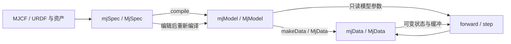

# E1 · 从 MJCF 到模型、坐标与惯量

阅读基线为 **MuJoCo 3.15.0 原生 C 核心与官方 Python 绑定**，固定提交 `9ea3cdfcae93bf2cc4dc0e1a1627c5a39a1e06e5`。本文覆盖应用路线 A1，以及 B0 的配置空间、刚体惯量与字段布局基础。先读[对象导读](guide.md)，具备矩阵乘法、旋转与牛顿力学基础即可；下一篇是[状态与时间](state-and-time.md)。

完成后应能把一个资产的单位、body 原点、质心、碰撞几何和关节自由度分别说清，并从 XML 追到编译数组。本阶段交付是源码课程，示例仅做静态检查，未进行 MuJoCo 模型编译或仿真。MJX、MuJoCo-Warp、viewer 等后端/宿主不在本篇行为保证之内；同名模型字段不证明后端实现相同。

## 1. 模型描述、编译产物和运行状态

| 层 | 负责什么 | Python 入口 | 容易误认的地方 |
|---|---|---|---|
| MJCF 与资产 | 原始建模意图、默认类、网格和纹理引用 | 文件，或 XML 字符串与 assets 字典 | XML 的文本顺序/数值不等于最终数组布局 |
| `mjSpec` | 可编辑对象树；解析与编译的分界 | `mujoco.MjSpec.from_file(...)`、`spec.compile()` | 编辑 spec 不会自动改变已编译的 model |
| `mjModel` | 编译后的拓扑、参数、索引、预计算常量 | `MjModel.from_xml_path(...)` 合并解析与编译 | 不是任意增删关节的动态容器；改值可能还需重算常量 |
| `mjData` | 某一实例的状态、派生量、求解工作区 | `mujoco.MjData(model)` | 拥有 `qpos` 不意味着 `xpos` 已与它同步 |

解析检查结构；编译检查语义、处理资产、生成自由度和惯量布局，还可能执行内部测试步。因此“没有显式 `mj_step`”不能描述为“编译器没有任何动力学计算”。本课不调用编译器；示例的加载成功仍未验证。[模型编辑与编译](https://github.com/google-deepmind/mujoco/blob/9ea3cdfcae93bf2cc4dc0e1a1627c5a39a1e06e5/doc/programming/modeledit.rst#L12)。

改变拓扑时回到 spec 再编译，并重新建立名字到 ID/地址的映射。Python 的 `recompile` 返回新的 model/data 对象以避免悬空引用；不要沿用旧 NumPy 视图或 ID。参数原位修改只适用于官方允许的字段及更新步骤，`mj_setConst` 也不是能修复所有拓扑变更的万能接口。[Python 重编译语义](https://github.com/google-deepmind/mujoco/blob/9ea3cdfcae93bf2cc4dc0e1a1627c5a39a1e06e5/doc/python.rst#L766)。

MJB 是版本相关的编译模型，不等于可编辑源文件或运行快照；MJZ 可以打包描述与资产，仍须保留资产许可。提交可复现课程时保留 MJCF、资产来源、编译选项与版本，不只保存 MJB。[编码格式](https://github.com/google-deepmind/mujoco/blob/9ea3cdfcae93bf2cc4dc0e1a1627c5a39a1e06e5/doc/programming/modeledit.rst#L69)。

## 2. 运动学树不是外观层级

`worldbody` 是固定世界根节点。嵌套 body 决定父子关系；body 内的 joint 引入该 body 相对父 body 的自由度。没有 joint 的 body 固连到父 body，添加一个子 body 或 geom 不会自动增加独立刚体运动。一个 body 可以有多个基本 joint；例如 slide、slide、hinge 可表达平面运动，不必人为插入多个无质量中间 body。[MJCF 运动学树](https://github.com/google-deepmind/mujoco/blob/9ea3cdfcae93bf2cc4dc0e1a1627c5a39a1e06e5/doc/modeling.rst#L46)。

- `geom` 给出形状，可参与碰撞、显示及惯量推断；同一 body 的多个 geom 随同一个刚体运动。
- `site` 是附着坐标/参考区域，常用于传感器和传动，不因显示出小球就变成碰撞刚体。
- `joint` 给出运动自由度与轴/锚点；不承担刚体几何或质量。
- `inertial` 给出质心与惯性主轴；其位置可以不同于 body 原点与每个 geom 的中心。
- `frame` 是建模变换组织方式，编译时变换传递给子元素；不要把它当成新增自由度。

`default`/`class`/`childclass` 是建模属性继承。显式值、默认类和推断值可能来自三处：调试先找最终有效设置，不能只看当前一行 XML。特别是 `<freejoint>` 不继承普通 joint 的 stiffness/damping/frictionloss/armature 默认值；用 `<joint type="free">` 时则可能继承到不想要的参数。[freejoint 的语义](https://github.com/google-deepmind/mujoco/blob/9ea3cdfcae93bf2cc4dc0e1a1627c5a39a1e06e5/doc/XMLreference.rst#L2520)。

## 3. 单位、姿态和坐标变换

本课程统一采用 SI：长度 m、质量 kg、时间 s、力 N、力矩 N·m、惯量 kg·m²。几何单位并不会由“文件来自 CAD”自动识别；若选用另一套一致单位，重力、密度、力矩、刚度等都必须相应转换。模型默认密度 1000 的解释依赖 SI，不能一边保留默认密度一边把毫米坐标当米。[geom 密度定义](https://github.com/google-deepmind/mujoco/blob/9ea3cdfcae93bf2cc4dc0e1a1627c5a39a1e06e5/doc/XMLreference.rst#L2781)。

| 量 | 本课程单位/约定 | 原生字段或输入 |
|---|---|---|
| 位置、尺寸、滑动关节位移 | m；box `size` 是三个半尺寸 | XML `pos/size`、`qpos` 的 slide 部分 |
| 转角、角速度 | 编译后 rad、rad/s | hinge `qpos/qvel`；ball/free 旋转另用四元数 |
| 姿态 | 右手系、`(w,x,y,z)`、单位四元数 | XML `quat`、`body_quat`、`xquat` |
| 重力 | m/s²，方向由向量指定 | `model.opt.gravity` |
| 质量、质心惯量 | kg、kg·m² | `body_mass`、`body_inertia` |
| 广义力 | slide 对应 N，hinge 对应 N·m；按自由度解释 | `qfrc_*` 长度 `nv` |

MJCF 的 `compiler angle` 默认是 degree，编译后 model 使用 radian；URDF 被解析器强制为 radian。教程显式写 `angle="radian"`。这个开关并非给所有裸数字统一换单位：四元数本来就不是角度值，某些 actuator 范围也有自己的原生单位，控制专题会单独解释。[angle 与 eulerseq](https://github.com/google-deepmind/mujoco/blob/9ea3cdfcae93bf2cc4dc0e1a1627c5a39a1e06e5/doc/XMLreference.rst#L831)。

定义 $R_{WB}$ 为将 body 坐标向量转到世界坐标的旋转，$p_{WB}$ 为 body 原点在世界中的位置。body 中一点 $r_B$ 的世界位置是

$$p_W=p_{WB}+R_{WB}r_B.$$

父子 pose 的组合为 $R_{WC}=R_{WB}R_{BC}$、$p_{WC}=p_{WB}+R_{WB}p_{BC}$。这些式子假设右手正交旋转、列向量及主动的坐标映射；矩阵乘法的顺序不能调换。XML 子 body 的 pose 相对父 body；geom/site/inertial 相对其所属 body。关节运动会在参考 pose 之上改变实际 pose，因此不能在运动后只连乘静态 XML body pose 来替代 FK。[建模坐标约定](https://github.com/google-deepmind/mujoco/blob/9ea3cdfcae93bf2cc4dc0e1a1627c5a39a1e06e5/doc/modeling.rst#L145)、[mj_kinematics 的组合与关节变换](https://github.com/google-deepmind/mujoco/blob/9ea3cdfcae93bf2cc4dc0e1a1627c5a39a1e06e5/src/engine/engine_core_smooth.c#L83)。

轴角 $(a,\theta)$ 对应 $Q=(\cos(\theta/2),a\sin(\theta/2))$，其中 $\|a\|=1$。$Q$ 与 $-Q$ 表示同一旋转；不要用四元数逐元素差来评价姿态误差。`euler` 使用全局 `eulerseq`：小写轴为随动轴，大写轴为固定父坐标轴，URDF 的 rpy 对应 MJCF 的 `XYZ`。把别的软件的 xyzw 或欧拉角直接贴入 `quat` 是常见的无报错错误。[姿态机制](https://github.com/google-deepmind/mujoco/blob/9ea3cdfcae93bf2cc4dc0e1a1627c5a39a1e06e5/doc/modeling.rst#L165)。

## 4. body 原点、质心和惯性主轴必须分开

令质心相对 body 原点为 $r_B$，惯性主轴相对 body 的旋转为 $R_{BI}$，主惯量为 $(I_1,I_2,I_3)$。在 body 轴表达的**质心惯量**为

$$I_{C,B}=R_{BI}\,\mathrm{diag}(I_1,I_2,I_3)\,R_{BI}^{T}.$$

如果外部 CAD 给的是绕 body 原点的惯量，则有平行轴关系

$$I_{O,B}=I_{C,B}+m\big((r_B^Tr_B)\mathbf{1}-r_Br_B^T\big).$$

两边必须在同一坐标轴表达；从原点惯量得到质心惯量应减去平行轴项。不能把绕关节原点的 CAD 惯量直接写进 `diaginertia`，也不能只旋转一个惯量对角数组而忽略非对角项。

| XML | 编译字段 | 物理含义 |
|---|---|---|
| `inertial pos` | `body_ipos` | 质心相对 body 原点的位置 |
| `inertial quat` | `body_iquat` | 惯性主轴坐标相对 body 的旋转 |
| `inertial mass` | `body_mass` | 刚体质量 |
| `inertial diaginertia` | `body_inertia` | 质心处、惯性主轴下的三个主惯量 |
| `inertial fullinertia` | 编译成主轴与主惯量 | 质心处对称张量，顺序 `Ixx Iyy Izz Ixy Ixz Iyz`，编译器做特征分解 |

完整惯量必须正定，主惯量还应满足任两项之和不小于第三项的物理约束。`balanceinertia=true` 会在违规时把三个主惯量改成平均值；它改变了模型，不能把“编译通过”当作修好了原始测量。`boundmass/boundinertia` 也必须作为建模修改记录。[inertial](https://github.com/google-deepmind/mujoco/blob/9ea3cdfcae93bf2cc4dc0e1a1627c5a39a1e06e5/doc/XMLreference.rst#L2237)、[编译器质量/惯量修正](https://github.com/google-deepmind/mujoco/blob/9ea3cdfcae93bf2cc4dc0e1a1627c5a39a1e06e5/doc/XMLreference.rst#L789)。

惯量也可由 geom 推断。`inertiafromgeom="auto"` 下，缺失 inertial 时才推断；`true` 强制由 geom 推断，`false` 要求另有惯性信息。只让指定 `inertiagrouprange` 内的几何参与，避免视觉网格和碰撞近似重复计入质量。碰撞关闭并不自动意味着该 geom 不参与惯量推断；`group` 的渲染可见性也不是碰撞开关。[惯量推断与 group 范围](https://github.com/google-deepmind/mujoco/blob/9ea3cdfcae93bf2cc4dc0e1a1627c5a39a1e06e5/doc/XMLreference.rst#L920)。

原创示例 [frames.xml](../examples/modeling-state-time/frames.xml) 中，free box 的 body 原点与质心相差 0.02 m，长方体全尺寸为 0.20 × 0.10 × 0.10 m、质量为 1 kg。均匀实心长方体绕质心的惯量 $I_x=m(b^2+c^2)/12$ 等循环得到 `(0.0016666667, 0.0041666667, 0.0041666667)` kg·m²。这里显式惯量与视觉 shape 一致只是作者的建模选择；真实机器人需由 CAD/测量说明质量分布。

free body 的 `alignfree` / `freejoint align` 优化可能将 body frame 对齐到惯性 frame，从而改变 qpos/qvel 的含义。旧 keyframe 数字不能未经核对跨编译选项复用。本例明确 `align="false"` 以保留教学中的原点偏移。[freejoint align](https://github.com/google-deepmind/mujoco/blob/9ea3cdfcae93bf2cc4dc0e1a1627c5a39a1e06e5/doc/XMLreference.rst#L2549)。

## 5. 视觉资产、碰撞资产与导入

常规 mesh geom 的显示表面可以凹，但碰撞使用其凸化表示；一个杯子看起来有内腔不代表碰撞体保留内腔。需要明确设计多凸体分解、原生几何或适用的其他机制；不要为了图像好看就认定接触拓扑正确。flex/SDF 等路线有不同适用条件，放到 E3/E6 展开。[mesh 碰撞边界](https://github.com/google-deepmind/mujoco/blob/9ea3cdfcae93bf2cc4dc0e1a1627c5a39a1e06e5/doc/modeling.rst#L1373)。

网格缩放由 mesh 顶点与 `mesh scale` 决定，引用该 mesh 的 geom `size` 不能充当通用缩放器。编译器还会对 mesh 居中和对齐主轴，相关偏移保存在 `mesh_pos/mesh_quat/mesh_scale`，并与引用 geom 的 pose 组合。读取编译后的顶点、原始文件顶点和 `geom_xpos` 时要注明各自处于哪个变换阶段；不要把偏移应用两遍。[mesh 预处理](https://github.com/google-deepmind/mujoco/blob/9ea3cdfcae93bf2cc4dc0e1a1627c5a39a1e06e5/doc/XMLreference.rst#L1283)。

mesh 的 `inertia` 模式又独立于显示与碰撞：本版本默认 `legacy`，对非凸网格可能多算体积；`convex` 用凸包，`exact` 要求正确定向、封闭的网格，`shell` 表达薄壳假设。精确体积惯量不会自动让碰撞也变为非凸。[mesh 惯量模式](https://github.com/google-deepmind/mujoco/blob/9ea3cdfcae93bf2cc4dc0e1a1627c5a39a1e06e5/doc/XMLreference.rst#L1385)。

一个可维护的资产条目至少保留：原作者/下载页、许可证、原文件校验值、原单位、转换比例、轴系、视觉/碰撞/惯量用途、修改记录。代码的许可证不自动覆盖下载的网格与纹理。本课使用原创 primitives，无第三方网格。

导入 URDF 时按下面顺序审查，不能只问“能否加载”：

1. 核实 link/joint 名称、根是否浮动、轴方向、reference pose 与限位。URDF 只覆盖 MuJoCo 功能的一部分，控制传动等高级语义不能由导入成功推定。
2. 核实 inertia 的单位、质心偏移、张量参考轴及正定性；记录修正，不静默扩大质量下限。
3. 核实 mesh 路径/缩放。`meshdir` 相对主模型文件解析；保存到新位置后重新核对依赖。
4. 核实编译选项差异：URDF 默认 `discardvisual=true`、`fusestatic=true`，MJCF 均默认 false；URDF 的角度固定 radian。视觉丢失、body ID 变化可能来自这些步骤。
5. 导出 MJCF 留作可审查的原生版本，记录转换来源和后续增强。URDF 解析不做完整 MJCF schema 检查，拼错扩展属性可能被忽略；需读回编译字段。

来源：[URDF 支持与限制](https://github.com/google-deepmind/mujoco/blob/9ea3cdfcae93bf2cc4dc0e1a1627c5a39a1e06e5/doc/modeling.rst#L1495)、[discardvisual/fusestatic](https://github.com/google-deepmind/mujoco/blob/9ea3cdfcae93bf2cc4dc0e1a1627c5a39a1e06e5/doc/XMLreference.rst#L883)。

## 6. 从作者字段追到运行字段

| 想查什么 | 静态描述/编译字段 | 当前状态/派生字段 | 何时有效 |
|---|---|---|---|
| body 参考 pose | `body_pos/body_quat` | `xpos/xquat/xmat` | 当前 qpos 的运动学计算之后 |
| 质心和主轴 | `body_ipos/body_iquat` | `xipos/ximat` | 当前 qpos 的位置阶段之后 |
| geom 的局部 pose | `geom_pos/geom_quat` | `geom_xpos/geom_xmat` | 同上，注意 mesh 编译变换 |
| site 的局部 pose | `site_pos/site_quat` | `site_xpos/site_xmat` | 同上 |
| joint 地址 | `jnt_qposadr/jnt_dofadr` | `qpos/qvel` 对应切片 | 输入本身有效，派生量须重新计算 |
| joint 参考锚点与轴 | `jnt_pos/jnt_axis` | `xanchor/xaxis` | 当前 qpos 的位置阶段之后 |

`mjData` 中这些 `x*` 是世界坐标派生量；`xmat/ximat` 为展平的 3×3 矩阵，Python 使用时按行主序恢复矩阵并明确向量约定。改 `data.xpos` 不是改变关节配置，下一次前向计算会重新覆盖。真正设置配置应改原生 qpos 或相应 mocap 输入，然后更新所需派生阶段。[字段定义](https://github.com/google-deepmind/mujoco/blob/9ea3cdfcae93bf2cc4dc0e1a1627c5a39a1e06e5/include/mujoco/mjdata.h#L212)。

## 7. 阅读练习与答案

**练习 1：** 质量 2 kg、全尺寸 0.2 × 0.1 × 0.1 m 的实心盒子，XML 的 `size` 与主惯量分别是什么？如果整体长度缩小为原来的 1/10、质量保持不变，惯量怎样变？

答案：`size="0.1 0.05 0.05"`；质心主惯量约 `(0.0033333, 0.0083333, 0.0083333)` kg·m²。质量不变时惯量缩小为 1/100；若保持密度不变则质量也缩为 1/1000，惯量缩为 1/100000。这两种假设不能混用。

**练习 2：** 父 body 绕世界 Z 轴转 90°，原点为 `(1,0,0)`；子点在父坐标为 `(1,0,0)`。其世界位置是什么？

答案：`(1,1,0)`。先旋转局部位移，再加父原点。若算出 `(2,0,0)`，漏掉了旋转。

**练习 3：** 在自由物体内部加两个无 joint 的 body，各加一个 geom，`nv` 是否增加？关闭这些 geom 的碰撞是否保证质量不变？

答案：不增加独立自由度；它们固连于父 body。质量是否改变取决于惯量声明与推断设置，`contype=conaffinity=0` 不能替代惯量配置。检查编译出的 `body_mass/body_inertia` 及焊接/静态融合规则。

**练习 4：** URDF 导入后相机画面里模型消失，body 名称/ID 也变少，应先检查什么？

答案：先核对 `discardvisual` 与 `fusestatic`、geom group 和资产路径，再核对相机/渲染。成功解析和碰撞仍在不证明视觉资产保留。重编译后旧 ID 不能复用。

**练习 5：** `data.xpos[b]` 和 `data.xipos[b]` 不同能否断言 FK 错误？

答案：不能。前者是 body 原点，后者是质心；应以当前 `xmat` 旋转 `body_ipos` 后加到 `xpos`，核对是否等于 `xipos`。必须先确保这些数组对应同一配置和更新阶段。

本篇的静态验收、来源覆盖和未运行边界见 [E1 验证记录](validation/e1.md)。接着阅读[状态与时间](state-and-time.md)，把模型的物理含义连接到状态内存与一步仿真。
