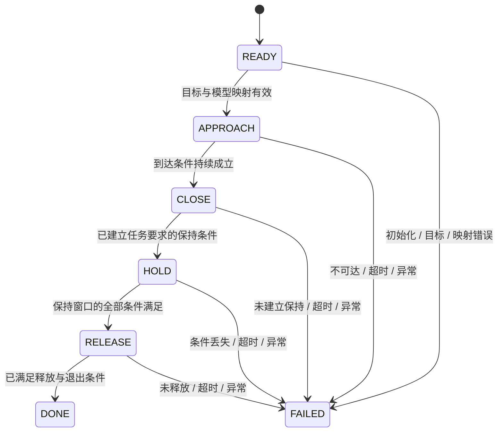

# E2 · 任务状态机与 MuJoCo 控制接口

基线为 MuJoCo 3.15.0 原生核心/官方 Python，固定源码 `9ea3cdfcae93bf2cc4dc0e1a1627c5a39a1e06e5`。先修：[驱动与控制](actuation-and-control.md)、[机器人运动学](robotics-and-kinematics.md)和 E1 的采样阶段。本篇完成 A7：设计接近、闭合、保持、释放流程时，明确谁写目标、谁推进时间、用什么证据转移、失败后如何恢复。

MuJoCo 提供物理状态、控制和观测接口；任务阶段、计时、目标有效性与完成条件由应用维护。本篇是接口设计教程，没有运行抓取，没有新建实验协议或评分器；最终案例与结果复用 [DexLab](https://github.com/huangkiki/Dexlab) 的已冻结任务、版本和判据。

## 1. 先定义任务状态，而不是写几个固定 sleep

任务状态至少含 `phase`、`phase_enter_time`、当前目标、最近命令序号和结束原因。它们不自动存入 mjData；可以是应用中的小型记录，也可按明确编码存入 userdata，但不要为此创建跨引擎框架。episode reset 或恢复快照时，这些字段必须与物理状态共同处理。[用户状态与 userdata](https://github.com/google-deepmind/mujoco/blob/9ea3cdfcae93bf2cc4dc0e1a1627c5a39a1e06e5/doc/programming/simulation.rst#L309)。



这是应用阶段，不是碰撞求解器的内部状态。`FAILED` 必须保留具体原因，不能把所有失败改成 done，也不能只因计时结束就进入下一阶段。安全退让/停止目标由实际机器人与任务指定；某个 actuator 的 ctrl=0 可能代表零位置或零速度，不能普遍当作“电机关闭”。

## 2. 每个阶段的命令与观测契约

| 阶段 | 输出到控制器的目标 | 进入下一阶段的依据 | 典型失败与所需记录 |
|---|---|---|---|
| READY | 已核实的初始 joint/末端目标、开爪目标 | 模型/命令映射有效，初始状态与目标可用 | 资产或名称不匹配、目标过期、初始化不完整 |
| APPROACH | 末端路径或 joint 轨迹；保持开爪 | 位姿误差与运动状态达到任务要求，并满足规定持续窗口 | IK 未收敛、目标不可达、限位/饱和阻碍、超时 |
| CLOSE | 指宽/关节/力目标及其速率限制；末端保持 | 当前任务定义的接触/物体保持条件成立 | 空夹、提前触碰、目标饱和、条件迟迟不成立 |
| HOLD | 保持驱动目标或有明确依据的控制策略 | 整个保持窗口内要求都成立 | 物体滑移、接触丢失、对象掉落、饱和/数值异常 |
| RELEASE | 开爪与约定退出动作 | 对象已按任务要求释放，且退出条件满足 | 粘连/约束仍启用、未打开、超时 |
| DONE / FAILED | 明确的终止命令策略 | 不再自动推进任务阶段 | 保留最后有效观测、原因、命令与时间 |

表中的阈值、持续窗口、允许条件不是本教程新设定的实验参数。接入 DexLab 案例时引用其实际协议字段、单位和版本；本篇只解释这些判据如何消费可靠的 MuJoCo 观测。

“夹爪位置到达”仅是关节条件，不证明物体被夹住；“有接触”不证明接触承担了需要的力；“保持了一段时间”还要知道物体是否滑移。也不能用 ctrl、actuator_force 或 qfrc_actuator 直接替代物体接触力，这些量位于不同空间、不同限制阶段。[驱动力映射](https://github.com/google-deepmind/mujoco/blob/9ea3cdfcae93bf2cc4dc0e1a1627c5a39a1e06e5/src/engine/engine_forward.c#L975)、[接触记录解释](https://github.com/google-deepmind/mujoco/blob/9ea3cdfcae93bf2cc4dc0e1a1627c5a39a1e06e5/doc/programming/simulation.rst#L1188)。E3 会展开接触与力观测。

## 3. 四层接口直接对上原生字段

| 应用层 | 输入/输出 | 原生 MuJoCo 对应 | 所有者 |
|---|---|---|---|
| 任务阶段 | 末端目标、夹爪目标、结束原因 | 没有一个“抓取任务 API”；由应用保存 | 任务更新函数 |
| 运动生成 | qd/vd 或末端误差 | FK、jacSite、integratePos 的候选配置；不写 live qpos 执行轨迹 | 规划/控制计算 |
| 执行器命令 | motor 力请求，或 pid/position setpoint | 按 actuator ctrladr/ctrlnum 写 data.ctrl | 唯一物理/控制线程 |
| 物理与反馈 | 状态、力、接触、传感观测 | data.time/qpos/qvel、对应派生字段 | 原生 step/forward 与采样代码 |

不要把任务枚举编码进 ctrl，也不要从 ctrl 数值反推当前阶段。控制目标可能在多个阶段相同，阶段转换还依赖观测历史。一个环境只设一个时间推进者；viewer、网络订阅回调和任务循环不能各自调用 mj_step。

物体位姿误差要先明确 frame。例如物体相对夹爪的平移为 $p_{GO}=R_{WG}^T(p_{WO}-p_{WG})$。世界坐标的物体移动可能来自整只手运动，并不一定是滑移；反之，世界位置变化很小也不保证对象相对手稳定。对象 pose 取其明确的 body/site，不能将 body 原点与质心混用；姿态差要在 SO3 上处理。[坐标与速度约定](state-and-time.md)。

## 4. 一个控制 tick 的顺序

以下为架构伪代码，不是可执行例程。它假设固定物理步、普通单步积分、没有另行安装控制回调；若使用 RK4 阶段反馈或 sleep/IPC，应重新审查 E1 的时序限制。

```text
在控制 tick 开始：
    取出最近的命令快照；校验序号、名称、单位、时效和维度
    使用上一个已完成采样批次的观测，最多执行一次阶段转移
    若已结束，输出任务定义的终止命令并停止阶段推进
    将当前阶段的目标变成 native actuator 输入，记录请求和限速目标

在本控制周期内的每个物理步：
    写入本步选择的 ctrl（零阶保持或明确的插值策略）
    在约定位置/力采样点复制观测，附模拟时间和 phase
    调用 mj_step 一次
    检查 warning/reset/非有限值或任务规定的即时异常

在控制 tick 结束：
    生成本周期带时间范围的观测快照与失败事件
    更新有效条件持续时长，留给下一控制 tick 决定阶段
```

这一顺序允许一周期反馈延迟，必须作为控制契约记录；若选择当前状态同步观测后立即转移，则固定另一条明确顺序。不能在不同阶段随意把观测从 pre-step 改为 post-step 而不更新解释。

若在 post-step 读取新 qpos/qvel，它们已到新时刻；某些 position/force/sensor 派生量尚来自之前或内部评估。需要新时刻 pose 时重算运动学，需要新的完整前向结果时执行适用的 forward，但必须记录其回调副作用与力含义。额外 forward 的新状态力不等于刚才那一步积分采用的力。[源码 step 顺序](https://github.com/google-deepmind/mujoco/blob/9ea3cdfcae93bf2cc4dc0e1a1627c5a39a1e06e5/src/engine/engine_forward.c#L2023)。

stage transition 不放在 `mjcb_control` 中：RK4 或前向检查可能多次调用它，导致重复 CLOSE→HOLD、重复计时或重复触发外部命令。阶段目标在一个控制 tick 内保持明确，回调只计算所需反馈，不能默默推进应用阶段。[回调生命周期](actuation-and-control.md)。

## 5. 持续条件、超时与“新鲜观测”

任务判据常需持续成立，而不是某个瞬间命中。维护 `condition_since` 时，如果条件变假、观测无效或时间序列中断，就按协议重置；不能把多个零散的真片段累加成连续保持。每个判据还要指定使用哪个空间量、单位、frame 与采样阶段。

时间至少分成三类：

- `sim_time`：data.time，衡量模拟保持/运动时长。
- 控制 tick 序号：决定外层控制和状态机实际执行次数。
- 墙钟与消息时间戳：检查外部消息延迟、丢包和执行耗时。

慢速渲染使墙钟经过一秒，不意味着物理也推进了一秒。暂停时模拟保持计时应暂停，外部消息过期策略则可能仍按墙钟执行。reset 导致 data.time 回跳时，应开始新 episode 或恢复同一 checkpoint 的应用时钟，不能将旧 `phase_enter_time` 继续与新 time 相减。

每个阶段需要一个明确的最大等待和失败原因；期限到达与成功证据同时出现时的优先级也属于协议。若真实异常已出现，后来的“目标误差恰好很小”不应覆盖异常；正常完成与截止是否包含端点则按协议固定，不能观察结果后再调整。

只用上一条缓存传感值还需判断其年龄。例如 sensor 延迟或 interval 可让数值本来就不是当前时刻；读取成功不是新数据到达的证据。E4 展开 sensor 原生时间语义，任务层现在应预留“值、测量时刻/阶段、有效性”三个信息，而不是仅一个 float。

## 6. reset、恢复与异常记录

一次完整任务 reset 应明确：原生 data reset/keyframe、外部控制积分器/滤波器、任务阶段和计时、命令快照/序号、观测历史/连续条件、随机源和日志 episode 标识。原生 reset 不会替你重置 Python 对象，也不会取消未消费的外部指令。

恢复中间状态时，保存 E1 定义的物理/输入/额外状态，还要保存 task/controller 状态与目标来源。只恢复 qpos/qvel 而让阶段回到 READY，或物理回到 READY 而应用仍是 HOLD，都不能称为一致恢复。sleep/IPC/plugin 的额外状态边界仍适用。[状态恢复边界](state-and-time.md)。

一个失败记录应足以回答：在哪个模型/资产版本、哪个阶段、哪个模拟时刻、收到了什么目标、驱动是否饱和、最后有效观测是什么、为什么结束。保留原始失败原因，不为提高完成率而重置后只保留成功段；同时避免将全部环境/网络凭据写入公开课程记录。

区分三个不同结果：

1. **接口检查通过**：字段、维度、范围、命令到输入的映射符合设计。
2. **任务运行完成**：按规定状态机到达 DONE，并有观测与日志证明每次转移。
3. **实验判据通过**：按已冻结协议和适用证据完成评分。

本轮只交付接口与知识课程，连第二项也没有实际执行。第三项将复用 DexLab；教程中一个布尔 `converged` 或 DONE 标签不能替代该证据。

## 7. 常见替代行为为什么改变任务

| 做法 | 改变了什么 | 更准确的解释 |
|---|---|---|
| 每帧将物体 pose 写成夹爪 pose | 物体运动直接由应用指定 | 是运动学摆放，不是接触保持 |
| CLOSE 后自动开启 weld | 新增软约束承担保持 | 是约束辅助机制，必须作为任务条件公开 |
| 力矩到限额就认为抓到物体 | 饱和也可由关节限位/空夹/模型问题引起 | 需任务规定的对象与接触证据 |
| 只等待固定墙钟时间后释放 | 不保证经过相同模拟时长或持续条件 | 按 sim_time 和有效观测窗口判断 |
| IK 失败时直接覆盖目标 qpos | 跳过了运动生成失败和真实执行 | 应报告不可达/未收敛，并执行约定失败分支 |
| 在多个线程直接写 data | 状态和观测不再有单一所有者 | 网络只交付命令快照，原生 data 保持单写者 |

这里没有要求所有任务都必须使用接触抓取；约束辅助演示或纯运动学教程也可以成立，只需明确它们的机制，不能将其结果改名为真实接触的成功。

## 8. 阅读练习与答案

**1.** APPROACH 的 position 误差第一次进入阈值，但速度很大，是否应立即 CLOSE？

答案：取决于冻结的到达条件；若要求停稳与持续窗口，则一次位置命中不足。需要记录速度与连续有效观测，不能只看一个布尔距离值。

**2.** HOLD 中物体随手臂上升 10 cm，这能否直接判定滑移？

答案：不能。先计算物体相对夹爪的 pose 变化，并按任务要求的 frame/误差定义判断；世界运动和相对滑移不同。

**3.** RK4 下回调内把 phase timer 每次加 h，有什么后果？

答案：一个物理步可能多次触发回调，计时和转移会超前。任务 tick 应由外层确定；阶段内反馈使用固定任务目标。

**4.** 在失败后调用 mj_resetData，但不清空网络命令队列，会发生什么？

答案：旧 episode 的目标可能在新状态立刻重新生效，原生 reset 并不使外部命令失效。应按序号/episode/时间戳拒绝过期目标并重置应用状态。

**5.** elbow_motor 的 ctrl=0 与 shoulder position/pid 的 ctrl=0 都表示停止吗？

答案：不相同。理想 motor 的零输入是零驱动输出请求；servo 的零位置/速度 setpoint 仍可能产生很大的恢复力。终止动作必须按每个 actuator 的契约定义。

**6.** XML/AST 和字段审查全绿，能否将 CLOSE→HOLD 在看板上写成“已验证夹持成功”？

答案：不能。静态知识交付不产生物理证据。课程开发阶段可完成，抓取实验保持未运行；后续引用 DexLab 的实际版本/工况/判据。

[E2 验证记录](validation/e2.md)区分本篇已交付的任务接口设计与尚未运行的任何任务实例。下一阶段 E3 可沿“请求驱动力为何不等于接触力”继续深入接触、约束与求解器。
